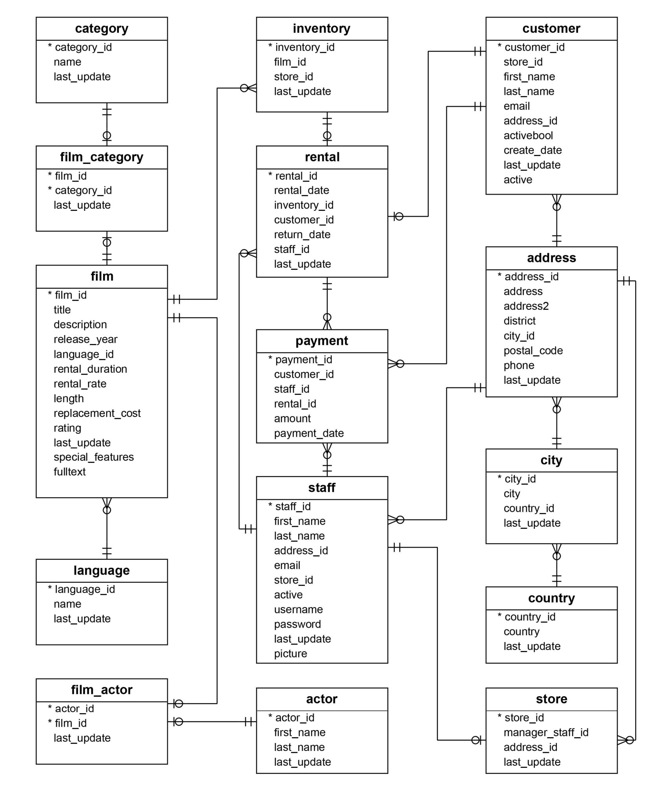
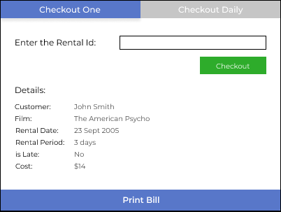
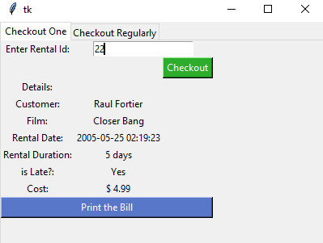

## Keywords
**Table:** A table is a collection of related data held in a table format within a database. In relational databases, and flat file databases, a table is a set of data elements (values) using a model of vertical columns (identifiable by name) and horizontal rows, the cell being the unit where a row and column intersect.

**Trigger:** A trigger is a stored procedure in database which automatically invokes whenever a special event in the database occurs.

**Views:** A database view is a searchable object in a database that is defined by a query.

**Function:** The Database functions perform basic operations, such as Sum, Average, Count, etc., and additionally use criteria arguments, that allow you to perform the calculation only for a specified subset of the records in your Database.

**Domain:** A database domain, at its simplest, is the data type used by a column in a database. This data type can be a built-in type (such as an integer or a string) or a custom type that defines constraints on the data.

**Sequence:** A sequence is a database object which allows users to generate unique integer values.

(Source: First Google Result)

---

## About Database
The DVD rental database represents the business processes of a DVD rental store. The DVD rental database has many objects including:
- 15 tables
- 1 trigger
- 7 views
- 8 functions
- 1 domain
- 13 sequences

Tables:
- actor — contains actors data including first name and last - name.
- film — contains films data such as title, release year, length, rating, etc.
- film_actor — contains the relationships between films and actors.
- category — contains film’s categories data.
- film_category — containing the relationships between films and categories.
- store — contains the store data including manager staff and address.
- inventory — stores inventory data.
- rental — stores rental data.
- payment — stores customer’s payments.
- staff — stores staff data.
- customer — stores customer’s data.
- address — stores address data for staff and customers
- city — stores the city names.
- country — stores the country names.
- language — stores the language names.

ER Diagram:


---

## Database Cleaning
Data is one of the most important asset for an organization. With the ever increasing generated data and the requirement of having a good quality dataset makes it necessary to have a process of correcting and deleting inaccurate records from a database. This process is referred to as Data Cleaning or Data Cleansing.

Some of the benefits of Data Cleaning are:

- Increased Productivity: Having no inconsistency in database will definetly increase productivity of an organization
- Error Reduction: Not having any duplicate data or incorrect data can prevent future problems/bugs in the system
- Cost Efficient- Data Cleaning done right or one can say if data cleaning is done from the first phase where it was just getting collected it can save a lot of cost compared to the scenario where the databse cleaning is done just before using the data for a purpose

Data cleaning is done keeping in mind the use of the data and how the data is stored. So, one needs to develop different database cleaning strategies for each case.

### Database Cleaning Strats
1. **Data Quality Plan**: One needs to set the quality standards also known as Data Quality KPIs (Key Performance Indicators)
2. **Standard Entry Points**: Having standardized entry points is a critical feature to have. These allows the database to not have dirty entries from the start.
3. **Accuracy Validation of Data**: Data needs to be validated in real-time.
4. **No Duplicates**
5. **Removal of data that becomes invalid**

A good database cleaning strategy must:
- have the ability to detect errors and inconsistencies in the database
- reduce the manual work
- have the ability to correct errors if possible

### Our case
We have taken the classical postgresql database of dvdrental store. We will try to implement cleaning of data after a transaction happened. This can be done in two ways: Cleaning as soon as the transaction happens and the other way is to store the record to be deleted and run a cron job after a specific interval to delete the records.

This sample database can have multiple different situations in which it requires cleaning. Some of them are as follows:
- Out of the two stores, one closes
- Store decides that they will not rent a particular type of dvds
- Some staff member leaves
- Customer returns the dvd and now there is no need to store his information anymore

And many more...
But we will focus on the last scenario.

### Problem Statement
Make a gui based application to handle the transactions in which customer returns the dvd he rented. This application shoul have two modes of deleting the data from the database, first mode: instantly and second moed: after an interval. After the successful transaction it should be able to print a bill too.

UI design:


### Procedure

In our sample database there are two stores namely, store 1 and store 2. And they share a common rental record table. The schema of which is as follows:
`rental_id, rental_date, inventory_id, customer_id, return_date, staff_id, last_update`

To extract the information of a user who comes to return the dvd:
```
with conn.cursor(cursor_factory=psycopg2.extras.DictCursor) as cur:
	cur.execute(f" \
		SELECT customer_id, inventory_id, rental_date FROM rental \
		WHERE rental_id = {id} \
	")
	rentalData = cur.fetchone()
	result['customer_id'], result['inventory_id'], result['rental_date'] = [rentalData[k] for k in ('customer_id', 'inventory_id', 'rental_date')]

	cur.execute(f" \
		SELECT film_id \
		FROM inventory \
		WHERE inventory_id = {result['inventory_id']} \
	")
	result['film_id'] = cur.fetchone()['film_id']

	cur.execute(f" \
		SELECT title, rental_duration, rental_rate \
		FROM film \
		WHERE film_id = {result['film_id']} \
	")
	filmData = cur.fetchone()
	result['film_title'], result['rental_duration'], result['rental_rate'] = [filmData[k] for k in ('title', 'rental_duration', 'rental_rate')]

	cur.execute(f" \
		SELECT first_name, last_name \
		FROM customer \
		WHERE customer_id = {result['customer_id']} \
	")
	name = cur.fetchone()
	firstName, lastName = [name[k] for k in ('first_name', 'last_name')]
	fullName = f"{firstName} {lastName}"
	result['full_name'] = fullName

	return result

conn.commit()
```

For storing the information of the customer and delete the records at a scheduled time:
```
with open('daily.txt', 'r+') as myFile:
	for line in myFile:
		try:
			conn = psycopg2.connect(user=dbUser, password=dbPass, host=dbHost, port=dbPort, database=dbName)

			with conn.cursor(cursor_factory=psycopg2.extras.DictCursor) as cur:
				cur.execute(f" \
					DELETE \
					FROM rental \
					WHERE rental_id = {int(line.strip())} \
				")
			conn.commit()

		except (Exception, Error) as error:
			print("Error while connecting to PostgreSQL", error)

		finally:
			if (conn):
				conn.close()
				print("PostgreSQL connection is closed")
				myFile.truncate(0)
```

### Final Result
Final Application: 


### Learning Outcomes
- Various new concepts of databases
- Cronjob scheduling
- GUI based applications

### References
- https://synthio.com/b2b-blog/5-best-practices-for-data-cleaning/
- https://www.freecodecamp.org/news/project-1-analyzing-dvd-rentals-with-sql-fd12dd674a64/
